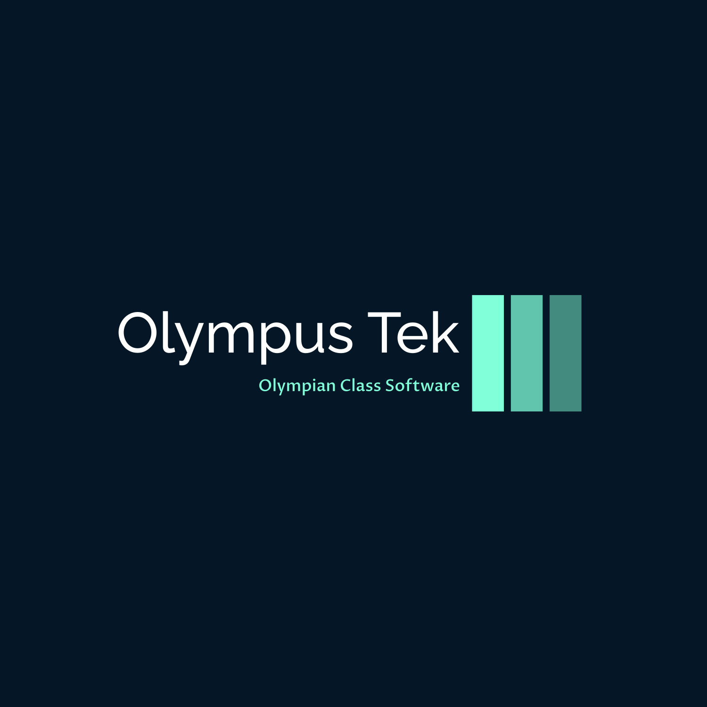

## About Olympus Tek

Olympus Tek is a dynamic software development company committed to pushing the boundaries of innovation. We specialize in creating Olympian class solutions that make a meaningful impact in the world of technology.

## Our Projects

### 1. [AthenX-2.0](https://github.com/KingVentrix007/AthenX-2.0)

**Description:** Project AthenX-2.0 is a revolutionary operating system designed for versatility. It strives to support various file systems like ext2/ext3/ext4, FAT/12/14/16/32 (All FAT filesystems), and NTFS. With an advanced command line and a basic GUI featuring a map display, Athena provides a seamless user experience. It is currently in pre-alpha state, with many feature not functioning or implemented

### 2. [HermesScript](https://github.com/KingVentrix007/Text-Game-engine)

**Description:** Project HermesScript is a Game Engine for Text based games. It uses "states" and keywords in a json file to save locations and characters for the game, the Free version is limited, but allows the user to quickly crate a simple game, however the free version does contain features of the pro version that will be removed at a later point. Only the free version is up dor download at the moment

### 4.MineCraft App

**Description:** The MineCraft App is an unfinished hobby project, it is simple to use and provided a offline wiki of of sorts for minecraft players to read about mobs. It is deprecated, but is included here for completeness

## Contact Us

Interested in collaborating or learning more about our projects? Feel free to reach out to us at <tristanjkuhn007@gmail.com>.

----------------------------------------------
Disclaimer: Olympus Tek is not an official compan.
